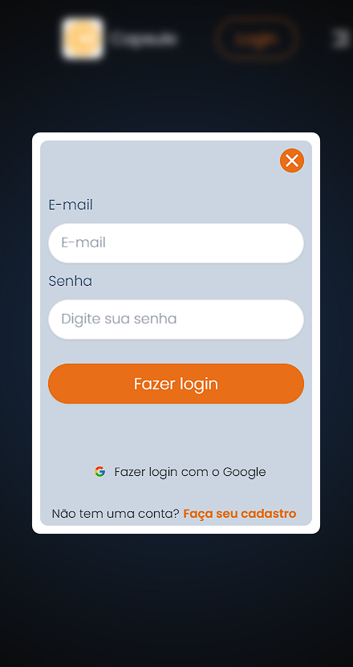
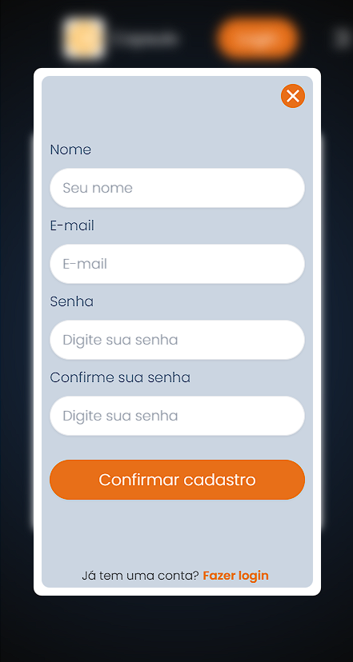
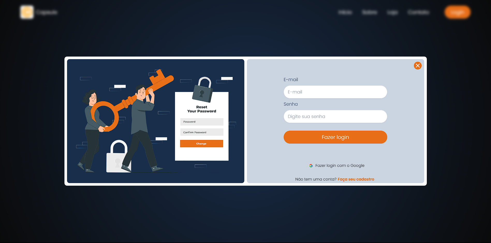
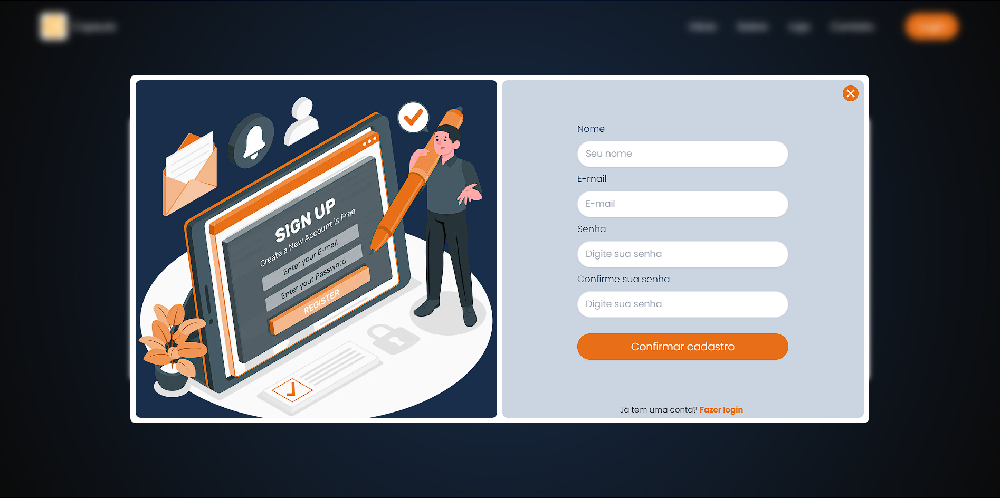

</h1>
   
<h1>NextAuth com Rota Paralela e Interceptação</h1> 

## Descrição

### Neste projeto, estou explorando as funcionalidades de [Rotas Paralelas](https://nextjs.org/docs/app/building-your-application/routing/parallel-routes) e ``interceptações`` do [Next.js](https://nextjs.org), utilizando um modal de login/registro como exemplo usando o [NexthAuth](https://next-auth.js.org/). Uma característica notável é a capacidade de realizar o login no sistema sem a necessidade de sair da página em que o usuário está atualmente, o que proporciona uma experiência mais fluida.

### A ``interceptação da rota`` de login ocorre de forma ``independente`` da página em que o usuário esteja, preservando a continuidade da experiência. Esse aspecto é particularmente valioso, pois ajuda o usuário a manter os dados e contexto da página atual. Por exemplo, se o usuário deseja efetuar uma compra, ele pode acessar o sistema de login sem abandonar a visualização do produto, evitando possíveis perdas de informação.

### Além disso, o projeto também explora a simulação de [Rotas Paralelas](https://nextjs.org/docs/app/building-your-application/routing/parallel-routes) em algumas páginas. Esse conceito permite carregar dados independentes na mesma página, administrando o carregamento de forma diferenciada. Esse enfoque demonstra-se bastante interessante em termos de flexibilidade e otimização do carregamento.

### É importante mencionar que, ao optar pelo `login com a conta do Google` pela primeira vez, o redirecionamento ocorre para a janela de autenticação do Google. Após a autenticação bem-sucedida, o usuário é direcionado de volta à página inicial, por conta da integração com o NextAuth. Alternativamente, se fosse empregada uma solução como o Firebase, essa interação poderia ser diferente, mantendo assim a página atual.

### Vale ressaltar que, `após a concessão inicial de permissões`, os redirecionamentos e processos subsequentes ocorrem de maneira mais suave, mantendo assim a página conforme exemplificado no vídeo.

[Ver Projeto](https://nexth-auth-modal-parallel-renovatt.vercel.app/)

#

## Layout mobile

## Layout web
 

<!--  -->
<!--  -->
<!--  -->
<!--  -->

 

## 🛠️ Tecnologias

💻 **Front-end**
- [Next.js 13.4](https://nextjs.org)
- [Typescript](https://www.typescriptlang.org)
- [NexthAuth](https://next-auth.js.org/)

📁 **Back-end**
- [Node.js](https://nodejs.org)
- [Prisma](https://www.prisma.io)
- [MongoDB](https://www.mongodb.com)

📚 **Bibliotecas**
- [zod](https://zod.dev/)
- [react-hook-form](https://react-hook-form.com/)
- [react-toastify](https://www.npmjs.com/package/react-toastify)
- [react-icons](https://react-icons.github.io/react-icons/)

🎨 **Estilização**
- [tailwindcss](https://tailwindcss.com/docs/installation)

🔋 **Versionamento e Deploy**
- [Git](https://git-scm.com)
- [Vercel](https://vercel.com/)

 

⚙️ **Configuranções e Instalações**

Clone do Projeto

    $ git clone https://github.com/renovatt/nexth-auth-modal-parallel.git

Instalando as dependências

    $ npm install

Iniciando o projeto

    $ npm run dev

 

**Como contribuir?**

- Você pode dar suporte me seguindo aqui no GitHub
- Dando uma estrela no projeto
- Criar uma conexão comigo no linkedin fazendo parte da minha networking e curtir o meu projeto.

 

**Autor**
[Wildemberg Renovato de Lima](https://www.linkedin.com/in/renovatt/)